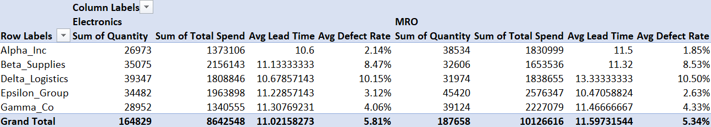
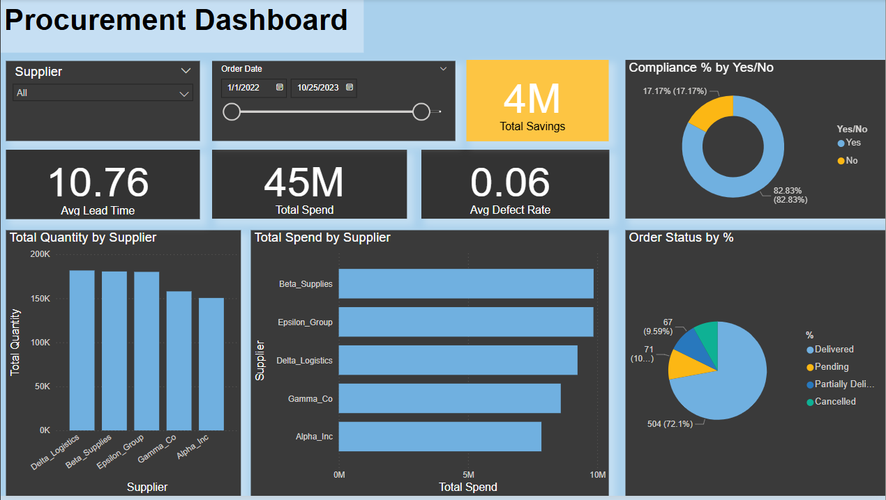

# 🧾 Procurement KPI Dashboard – Excel VBA + Power BI

This project automates procurement KPI analysis using Excel VBA and presents insights visually using Power BI. It includes end-to-end data cleaning, transformation, and dashboarding for decision support in vendor and purchase order management.

---

## 🚀 Features

✅ Automated data cleaning (blank removal, trimming, type conversion)  
✅ KPI calculations:  
&nbsp;&nbsp;&nbsp;&nbsp;• Total Spend  
&nbsp;&nbsp;&nbsp;&nbsp;• Total Savings  
&nbsp;&nbsp;&nbsp;&nbsp;• Lead Time  
&nbsp;&nbsp;&nbsp;&nbsp;• Defect Rate  
✅ Pivot Table creation (Supplier vs Item Category)  
✅ Power BI dashboard for interactive visualization  
✅ Modular VBA architecture (OOP-style with class modules)

---

## 📁 Project Structure

```plaintext
procurement-kpi-dashboard/
├── Procurement KPI Analysis Dataset.xlsm       # Macro-enabled Excel workbook
├── procurement_dashboard.pbix                  # Power BI dashboard file
├── Code/                                       # class modules in txt
└── Screenshots/                                # Screenshots of Pivot Table and Power BI views
```
---

## 📊 Screenshots

### Excel Pivot Table
📌 *Note: The screenshot displays only a portion of the PivotTable (for one item category) to maintain readability.*



### Power BI Dashboard



---

## 🛠️ Technologies Used

- Microsoft Excel (VBA Macros, Pivot Tables)
- Power BI Desktop
- Class Modules (OOP in VBA)
- ETL Techniques (via VBA)
- Data Modeling (in Power BI)

---

## ⚙️ How to Use

1. **Open** `Procurement KPI Analysis Dataset.xlsm`  
   - Press `ALT + F11` to view/edit the VBA code.
   - Run the macro `main()` to clean data, calculate KPIs, and generate the pivot table.

2. **Open** `procurement_dashboard.pbix` in Power BI Desktop  
   - Connects to the Excel data
   - Provides visualizations of calculated KPIs

> Tip: You can modify the dataset in the “PO_sheet” Excel tab and re-run the macro to analyze new data.

---

## 📈 Use Cases

- Vendor performance evaluation
- Procurement process optimization
- PO data analysis and savings identification
- KPI reporting for supply chain teams

---

## 🔍 Code Breakdown

- `ClsCleaner`: Handles all data preprocessing
- `ClsAnalyzer`: Computes KPIs like Total Spend and Lead Time
- `ClsPivot`: Creates dynamic pivot tables for visual summaries
- `main`: Central procedure to orchestrate the workflow

---

## 🧠 Future Enhancements

- Export KPI output as separate report (CSV or PDF)
- Schedule macro execution via Outlook or Windows Task Scheduler
- Power BI real-time refresh with Excel backend
- Advanced anomaly detection using Python

---

## 👨‍💼 Author

**Guruprasad P**  
Aspiring Data & Supply Chain Analyst | Passionate about AI and Business Intelligence.

🔗 Connect on [LinkedIn](https://www.linkedin.com/in/guruprasad2002/) 
📬 Email: *guruprem2002@gmail.com*

---


